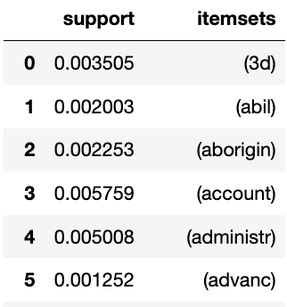
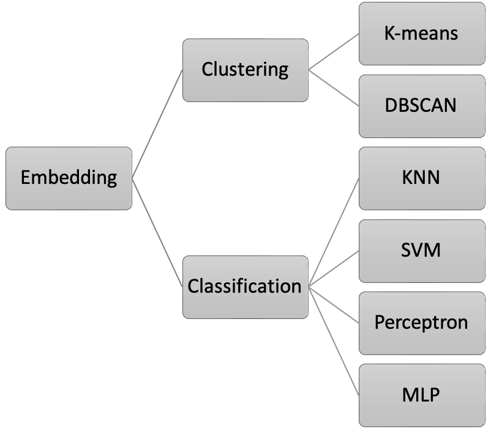
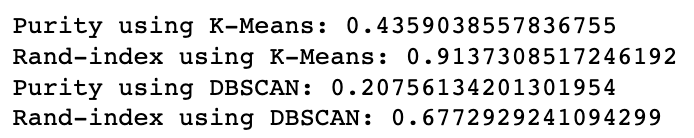
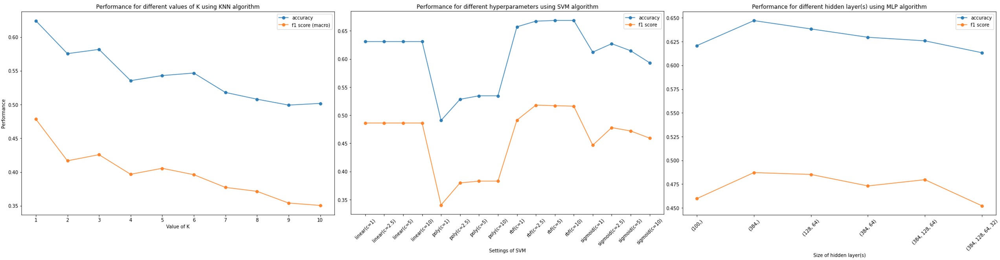
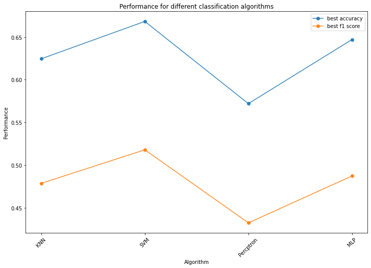

# Data Mining course projects

This repository contains our joint work (Mohammad Mohammadzadeh and I) in the context of the "Introduction to Data Mining" course (held at the Ferdowsi University of Mashhad) projects. We were supposed to do the projects in several phases, which are as follows: 

1. [Data crawling](#phase-1-data-crawling)
2. [Preprocessing & Feature extraction](#phase2-preprocessing--feature-extraction)
3. [Clustering & Classification](#phase3-clustering--classification)

## Phase 1: Data crawling
In this phase, we should first select a university as our crawling ta rget. Next, we should extract course information from the course catalog pages and then collect the course information according to the description. We finally chose <i>The University of Technology Sydney (UTS)</i>.

In our codes, we had to inherit from the given class `BaseCrawler` which was an interface for our codes. We used the `requests` and `BeautifulSoup` modules to crawl and parse the web pages. Additionally, to speed up the process, the code works with multi-threads (`threads_count=<INTENDED_THREADS_NUM>`).

On our target website, for most of the courses, the following information was provided: 

* Projects
* Scores
* Prerequisite
* Objective
* Description
* Course title
* Department name
* Outcome
* References

The output of this phase was a `CSV` file containing all the crawled courses (rows), as well as their information (columns).

## Phase2: Preprocessing & Feature extraction
In this phase, we had to preprocess and then extract features/keywords from the crawled data obtained from the [last phase](#phase-1-data-crawling). 

### Preprocessing
We had to work with 3 columns (features) for each course: Description, Objective, and Outcome, where all of them contain one or more sentences.

More concretely, we applied `stemming`, `lemmatizing`, and `removing stopwords` approaches to clean and preprocess the texts. It is worth mentioning that, we did not implement any of the above approaches from scratch, but also we took advantage of built-in modules provided by the `nltk` library.

<i>!!! Please note that, for the `removing stopwords` approach, we only relied on the provided `nltk` module and did not apply any further method to remove/ignore less valuable words, i.e. the words appeared numerous times but have not shown up among `nltk` stopwords; such as word <b>develop</b>. We could have easily used <b>TF-IDF</b> or sth like that to avoid these words, but since those words didn't make any trouble for our work, we skipped using such approaches!</i>

### Keyword Extraction
After tokenizing and preprocessing the texts, it was time to extract the keywords. In order to extract keywords, we used `KeyBERT`.
According to its [website](!https://maartengr.github.io/KeyBERT/):

> KeyBERT is a minimal and easy-to-use keyword extraction technique that leverages BERT embeddings to create keywords and keyphrases that are most similar to a document.

The following figure illustrates the <b>Wordcloud</b>s separately obtained from extracted keywords of each department. As you may have noticed, some words, e.g. develop, appear in most of the plots. This is mainly caused by the issue we have already discussed <a href="#words_issue_discussion">here</a>.

### Frequent Pattern Extraction
By having the keywords in hand, extracting the <b>Frequent patterns</b> was a piece of cake! We used `mlxtend` library to do such. In bellow, you can find a small snippet of this section's output.

## Phase3: Clustering & Classification
This phase itself is divided into 3 sections: `Embedding`, `Clustering`, and `Classification`.

### Embedding
In the previous phases, we crawled the required data, preprocessed it, and extracted the keywords. Meanwhile, in order to be able to compute the similarity/distance between two courses (for clustering and classification), the individual tokens are not so handy for us.

To address the above problem, we needed to work with vectors, so in that case, we can effortlessly use cosine distance for comparing the similarity between different courses. Hence, we took advantage of `SentenceTransformers` which, according to its webpage, is a:

> Python framework for SOTA sentence, text and image embeddings. . . . You can use this framework to compute sentence/text embeddings for more than 100 languages. These embeddings can then be compared e.g. with cosine-similarity to find sentences with a similar meaning.

### Clustering
We used `K-means` and `DBSCAN` algorithms to cluster the obtained vectors. Although the clustering had been done unsupervised, to be able to evaluate the clusters we needed some kind of labels for our data. Hence, we set each course's department as its label.

### Classification
Having ready vectors, as well as their labels, classifying the courses was not a pain in the rear! For this section, we used `SVM`, `Perceptron`, and `MLP` algorithms. Using these algorithms, we had a little bit more freedom to try different hyperparameters and we had to make an effort to tune them.

We finally took the best-obtained result from each algorithm and compared them together. Maybe, the obtained results seem discouraging at first, but please note that achieving the accuracy of ~68% while solving a classification problem with +40 existing classes (<i>random accuracy=~2.5%</i>) by using a very basic (and sometimes general) description for each course, make the results more valuable!

